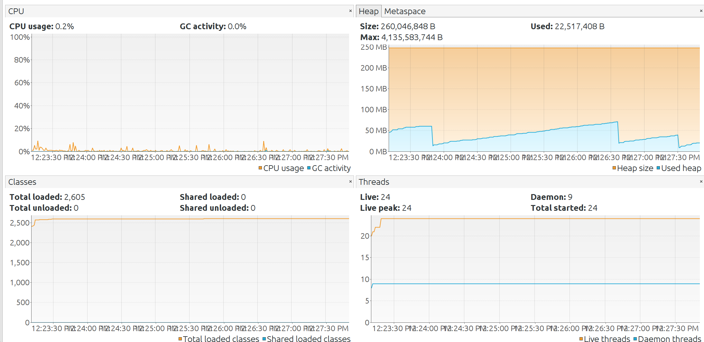
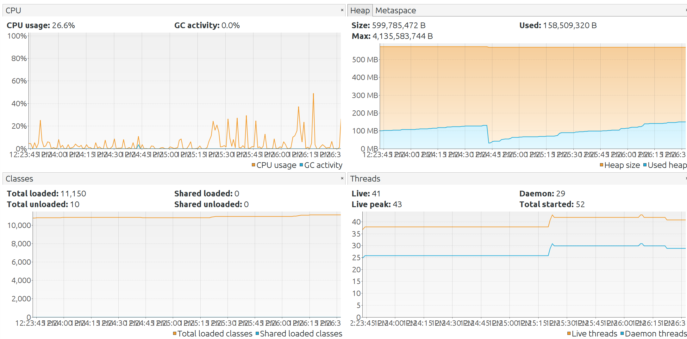

# What I Said I Would Do

In my original proposal I had goals for writing a simulation script, which simulate trading activity, as well as doing static/dynamic
analysis, and deploying the application on AWS.

# What I Did
I performed these as specified. One change I made was the progamming language used for the simulation script. Originally,
I had plans for using Python. I ended up writing the program in Go https://golang.org/. The reason for this change was because of the
limitations of Python. I needed the traders to input orders to the API concurrently. Concurrency is important to test the responsiveness
of my API and engine, since in an actual trading system receives many orders simulataneuously and has to be able to process
the orders effectively.In Python, there is not true "multithreading". There is a thread library but they actually cannot execute simultaneously
due to the Global Interpreter Lock. Go has concurrency mechanisms which enable me to basically put my backend to the test.
The one area where I lagged behind is in my simulation script algorithm. I wanted to implement actual strategies for the three traders
to really simulate how the market might look. Instead, my code spawns 3 traders which put in limit orders within a normal distribution
around the rough prices of the currencies. Whether the order is a buy or sell is 50/50. I performed static and dynamic analysis with
a heavier focus on the dynamic analysis, as much of my "static" analysis was done during each of the Homeworks/Checkpoints.
I also deployed the application on AWS as planned.

# Screenshots

