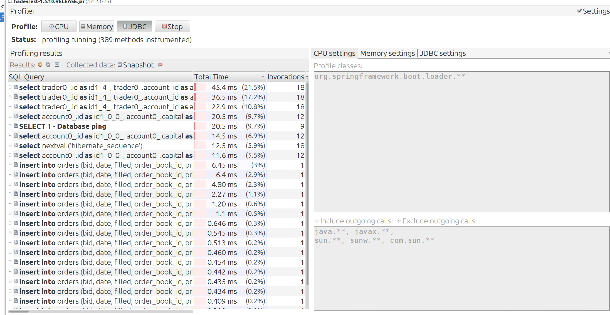

# What I Said I Would Do

In my original proposal I had goals for writing a simulation script, which simulate trading activity, as well as doing dynamic
analysis, and deploying the application on AWS.

# What I Did
I performed most of these as specified. One change I made was the progamming language used for the simulation script. Originally,
I had plans for using Python. I ended up writing the program in Go https://golang.org/. The reason for this change was because of the
limitations of Python. I needed the traders to input orders to the API concurrently. Concurrency is important to test the responsiveness
of my API and engine, since in an actual trading system receives many orders simulataneuously and has to be able to process
the orders effectively.In Python, there is not true "multithreading". There is a thread library but they actually cannot execute simultaneously
due to the Global Interpreter Lock. Go has concurrency mechanisms which enable me to basically put my backend to the test.
The one area where I lagged behind is in my simulation script algorithm. I wanted to implement actual strategies for the three traders
to really simulate how the market might look. Instead, my code spawns 3 traders which put in limit orders within a normal distribution
around the rough prices of the currencies. Whether the order is a buy or sell is 50/50. I performed dynamic analysis.
I also deployed the application on AWS as planned.

# Screenshots

This is dynamic analysis of the engine code. Those mini-cliffs aren't great, those are Garbage Collection calls which temporarily stop the system which for a latency sensitive system is pretty bad.

This is dynamic analysis of the Spring Boot Rest API.

This is dynamic analysis of the SQL Performance. The queries to get the account associated with the trader is the bottleneck.
This is done every trade.

This is command line output of the simulation program that's running

This is website deployed on EC2. Note the highlighted IP address.

# What I Would Do Next
There are aspects of the project I can improve upon. First, I believe the order book code should be split into more components. That code is functional but just too messy. Also I could've used a greater variety of design patterns. I mostly used Factory/Singleton designs. Even though I was working 
by myself, I probably should have used multiple feature branches. In terms of features I want to add going forward, the first would be a portfolio tracking system as well as Profit/Loss. I also think some type of payment integration would be important, although both of these are massive components on their own. Overall, this was a great project to work on and it was a good learning experience. With fairly consistent code schedules, I accomplished one of my core goals for the project.
